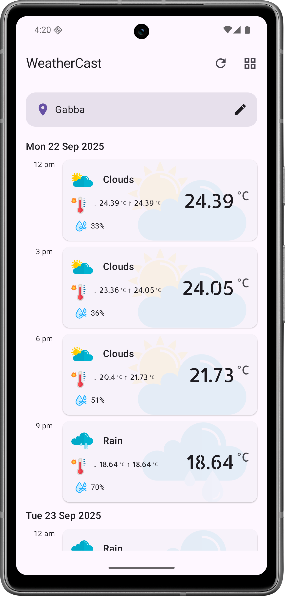
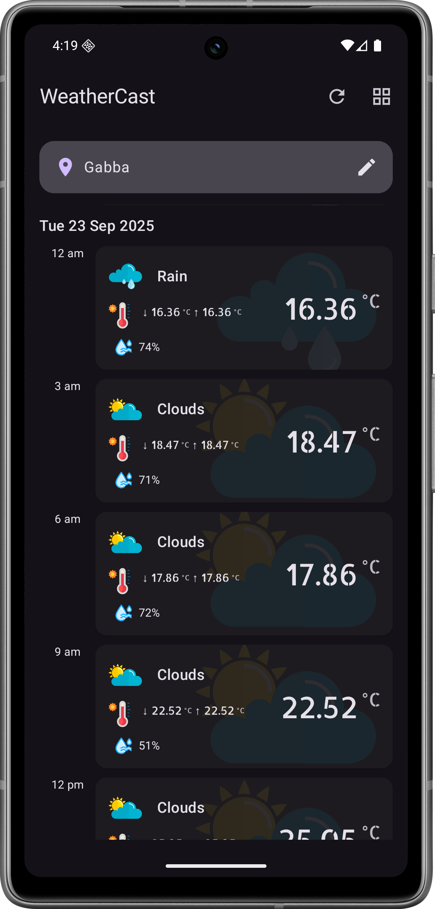

## 🌤️ WeatherCast

A modern weather forecast app built with Jetpack Compose. It supports both **light and dark themes**, works **offline**, and shows a **3-day weather forecast** based on city name using OpenWeatherMap API.

<p align="center">
  
  
  
  
</p>


---

###  API Key Setup

This app uses [OpenWeatherMap](https://openweathermap.org/api) to fetch weather data.

You must add your API key to the `local.properties` file in the root of the project:

```properties
OPEN_WEATHER_API_KEY = <Your API Key>
```

> Replace the value above with your own key if needed. This key is accessed safely through Gradle at runtime.

---

###  Features

* Search by city name
* Offline support (Room + local cache)
* Light/Dark mode support
* Stores last searched city (DataStore)
* Safe API calls with error fallback
* Clean, Material You-inspired UI

---

### Tech Stack

* Jetpack Compose
* MVVM + Hilt
* Room for caching
* Retrofit + Gson
* DataStore
* Kotlin Coroutines

---

### How it works

* App loads last searched city’s forecast on launch
* User can tap the FAB to search a new city
* Data is fetched and stored locally
* Offline mode uses cached results
* Errors (e.g., 404, no network) are shown with icons

---

###  Clone & Run

```bash
git clone https://github.com/kintanpatel/weather-cast
cd weather-cast
```

* Add your API key in `local.properties`
* Open in Android Studio and run

---
